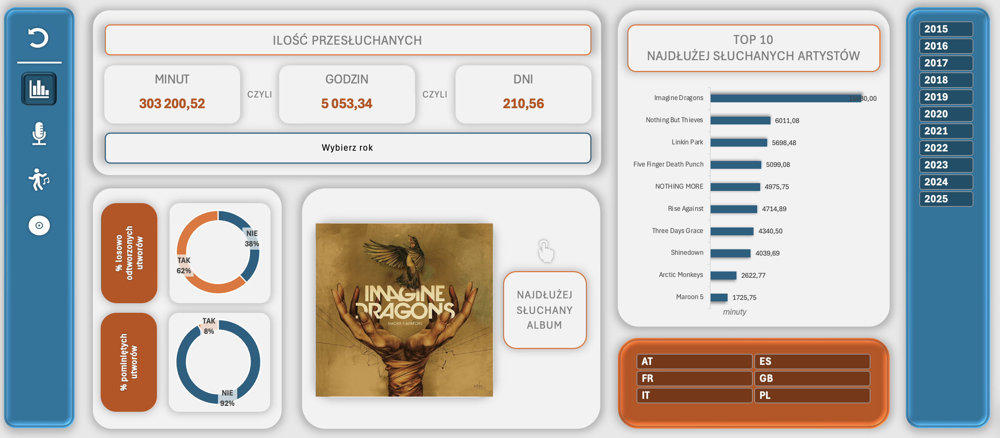

# Spotify Personal Data Dashboard in Excel

## Project Overview
This project is an interactive, fully functional Data Dashboard built in Microsoft Excel, designed to analyze and visualize personal Spotify listening history. It transforms raw Spotify data exports into clean, structured insights, allowing users to explore top artists, favorite tracks, and listening trends over time.

The entire data processing pipeline (ETL) and the visualization architecture were created from scratch, while a third-party VBA macro was integrated solely to enhance the visual experience by fetching album covers via the Discogs API.

## Features
* **Custom ETL Pipeline:** Complete extraction, transformation, and loading of raw Spotify data into a structured format ready for analysis.
* **Interactive Dashboard:** A dynamic user interface built entirely in Excel, utilizing interconnected Pivot Tables, Charts, and Slicers for deep-dive data exploration.
* **Automated Visual Enhancements:** Uses a VBA macro to communicate with the Spotify API and automatically download and display album cover art directly within the dashboard.

## Architecture & Workflow
1. **Data Ingestion & ETL:** 
   * Raw data (e.g., JSON files requested from Spotify) is loaded and cleaned.
   * The ETL process standardizes dates, parses nested information, and structures the data into a relational format suitable for Excel's data model.
2. **Data Visualization:** 
   * The core analytical engine relies on custom-built Pivot Tables.
   * Interactive charts and slicers allow for seamless filtering by date, artist, genre, or track.
   * Adding easy makro to clear all the filters that have been used by end user.
3. **API Integration via VBA :** 
   * To make the dashboard more visually appealing, a specific VBA macro is used to pull album images. 

## Prerequisites & Setup
To run this dashboard properly on your local machine:
1. Download the `.xlsm` (Excel Macro-Enabled Workbook) file from this repository.
2. Open the file in Microsoft Excel.
3. **Enable Macros:** You must enable macros when prompted by Excel; otherwise, the album covers will not load.

## Acknowledgments & Credits
* **Data Processing & Excel Dashboard:** Group project made during Master's Degree (ETL, data modeling, pivot tables, charts, and slicers).
* **VBA Macro (Spotify API):** The VBA script used to fetch album covers from the Discogs API was sourced from GitHub.